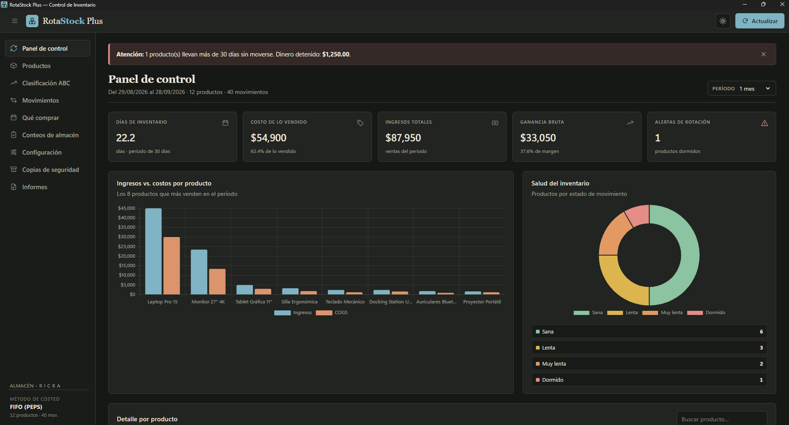
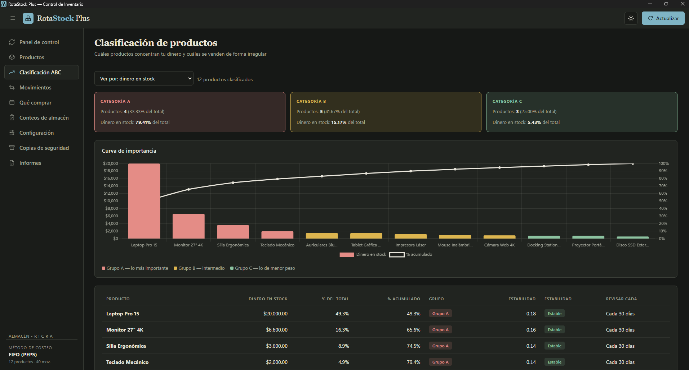
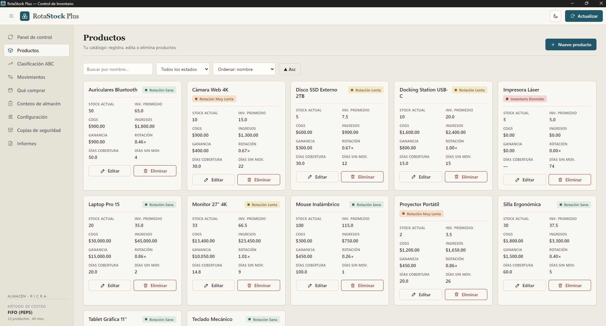

# RotaStock Plus — Control de Inventario con FIFO

> Aplicación de escritorio para Windows (Electron) para registrar compras y ventas, valorar el inventario con FIFO (PEPS), clasificar productos con ABC heurístico, planificar compras, auditar el almacén con conteos físicos y generar informes ejecutivos en PDF y Excel — todo 100% offline con un único archivo JSON de estado.

<p align="center">
  
  
  
  
  
  
</p>

<p align="center">
  
  
  
</p>

---

## Tabla de contenidos

- [Descripción](#descripción)
- [Módulos del sistema](#módulos-del-sistema)
- [Características principales](#características-principales)
- [Stack tecnológico](#stack-tecnológico)
- [Arquitectura](#arquitectura)
- [Motor FIFO y clasificación ABC](#motor-fifo-y-clasificación-abc)
- [Descarga](#descarga)
- [Instalación y uso](#instalación-y-uso)
- [Requisitos del sistema](#requisitos-del-sistema)
- [Persistencia y copias de seguridad](#persistencia-y-copias-de-seguridad)
- [Buenas prácticas de uso](#buenas-prácticas-de-uso)
- [Roadmap](#roadmap)
- [Licencia](#licencia)
- [Autor](#autor)

---

## Descripción

**RotaStock Plus** es la evolución del RotaStock original: conserva intacto su motor de replay FIFO verificado y lo extiende a **9 módulos** que cubren el ciclo completo del almacén — del registro de movimientos a la planificación de compras, la auditoría física y los informes ejecutivos.

Como en el original, el sistema **no almacena indicadores precalculados como fuente de verdad**. Cualquier alta, edición o baja dispara un *replay* completo: stock, COGS de cada venta, alertas, clasificación y sugerencias se recalculan desde la bitácora. Todo el estado vive en **un único JSON global** (`inventario_completo`), portable 1:1 entre PCs.

---

## Módulos del sistema

| # | Módulo | Qué hace |
|---|---|---|
| 01 | Panel de control | 5 KPIs, gráficos de ingresos vs. COGS, salud del inventario y detalle por producto, con período configurable |
| 02 | Productos | Catálogo CRUD con stock, rotación, cobertura y estado por tarjeta |
| 03 | Clasificación ABC | Grupos A/B/C por asignador heurístico + estabilidad de ventas (XYZ) y curva de Pareto |
| 04 | Movimientos | Bitácora de compras/ventas con buscador, filtros por tipo y por período |
| 05 | Qué comprar | Sugerencias de compra (cantidad y nivel de pedido) según ventas y tiempos de entrega |
| 06 | Conteos de almacén | Conteos físicos con ajustes automáticos, edición, reversión y exactitud (IRA) |
| 07 | Configuración | Umbrales de semaforización y datos del negocio |
| 08 | Copias de seguridad | Exportación/importación del JSON único + copias automáticas diarias |
| 09 | Informes | PDF ejecutivo de 6 secciones y Excel de 4 hojas con fórmulas vivas, por período elegible |

---

## Características principales

- **Motor de replay FIFO estricto (PEPS)** heredado y verificado del RotaStock original: cada venta consume el lote más antiguo; costeo no editable.
- **Clasificación ABC por proximidad**: asignador heurístico con tolerancia al error (sin cortes rígidos), más estabilidad XYZ y frecuencia de conteo sugerida.
- **Plan de compras**: pronóstico de ventas, reserva de seguridad y punto de pedido por producto, con alertas de compra.
- **Conteos auditables**: el físico vs. sistema genera el ajuste solo; cada conteo se puede editar o revertir como si nunca hubiera existido.
- **Semaforización por inactividad** (Sana / Lenta / Muy Lenta / Dormido) con umbrales configurables.
- **Informes elaborados**: PDF con portada, KPIs, tablas y gráficos; Excel con capas FIFO, ABC, plan de compras y resumen.
- **Seguro por diseño**: `contextIsolation` activo y `nodeIntegration` desactivado; el renderer solo usa un puente IPC (`db:load` / `db:save`).
- **100% offline**: sin conexión, sin backend, sin base de datos externa. Librerías vendorizadas (sin CDN).
- **Tema claro/oscuro** persistido y aplicado antes del primer pintado.
- **Modo navegador**: el frontend también corre fuera de Electron usando `localStorage`.

---

## Stack tecnológico

| Capa | Tecnología | Función |
|---|---|---|
| Escritorio | Electron 30 + electron-builder | Ventana nativa, instalador NSIS y portable |
| IPC | `preload.js` + `contextBridge` | Puente seguro de carga y guardado (JSON) |
| Presentación | HTML5 + CSS3 (claro/oscuro) | SPA de nueve vistas |
| Motor de negocio | JavaScript Vanilla (`Engine`) | Replay FIFO, ABC heurístico, pronósticos, métricas |
| Visualización | Chart.js 4 (vendorizado) | Barras, dona y Pareto (también incrustados en el PDF) |
| Exportación | SheetJS + jsPDF + autotable (vendorizados) | Excel de 4 hojas y PDF de 6 secciones, sin servidor |
| Persistencia | JSON único + `backups/` | Fuente de verdad local, offline |

Sin frameworks ni bundlers. `Engine` (en `frontend/app.js`) encapsula replay FIFO, clasificación, reabastecimiento y métricas.

---

## Arquitectura

```
RotaStock-Plus/
 ├── main.js              # Proceso principal: rutas Roaming, IPC, backups diarios, ventana
 ├── preload.js           # Puente IPC seguro: isElectron, loadDB, saveDB, backups
 ├── package.json         # Build nsis + portable
 ├── build/icon.ico       # Icono del exe e instalador (logo del sistema)
 ├── frontend/
 │    ├── index.html      # SPA de 9 vistas
 │    ├── style.css       # Paleta grafito cálido / papel + azul petróleo + arcilla
 │    ├── app.js          # Engine + render de los 9 módulos
 │    └── assets/
 │         ├── icon.png
 │         └── vendor/    # chart.umd, xlsx.full, jspdf.umd, autotable (offline)
 ├── datos/
 │    └── inventario.json # Estado en desarrollo (ignorado por git)
 └── backups/             # Copias automáticas (ignorado por git)
```

Instalado, los datos viven en `C:\Users\<usuario>\AppData\Roaming\RotaStockPlus\` (creada sola al primer arranque). En desarrollo se usa la carpeta del proyecto. El frontend empaquetado se sirve desde el `app.asar` (solo lectura).

---

## Motor FIFO y clasificación ABC

El núcleo es el replay cronológico verificado del RotaStock original: los movimientos se ordenan por fecha, se recorren uno a uno y se mantiene por producto una cola de lotes `{ remaining, costo, fecha }`. **Compra** agrega lote; **venta** consume desde el más antiguo (`COGS = Σ take·costo`). De ahí salen rotación (`COGS / inventario promedio`), cobertura, días de inventario y días sin movimiento.

La **clasificación ABC** no usa cortes rígidos 80/95: el asignador heurístico por proximidad compara, al cruzar cada umbral, qué tan cerca queda el acumulado incluyendo vs. excluyendo el producto (el empate promueve). La **estabilidad XYZ** mide qué tan parejas son las ventas mes a mes (Estable / Variable / Irregular) y define cada cuánto contar cada grupo (A: 30 días, B: 60, C: 120).

> La memoria descriptiva completa del proyecto está disponible en [`docs/Memoria_Descriptiva_RotaStock_Plus.pdf`](./docs/Memoria_Descriptiva_RotaStock_Plus.pdf).

---

## Descarga

Última versión publicada (instalador para Windows):

- [Releases de RotaStock Plus](https://github.com/TeVerde29/RotaStock-Plus/releases/latest)

> Si el nombre del repositorio es otro, ajusta el enlace.

---

## Instalación y uso

### Para usuarios: instalador

1. Descarga `RotaStockPlus Setup 2.0.0.exe` desde Releases.
2. Instálalo (puedes elegir la carpeta) — crea acceso directo en escritorio e inicio.
3. Tus datos se guardan automáticamente en tu PC (`AppData\Roaming\RotaStockPlus`).

### Para desarrolladores

```bash
# Clonar
git clone https://github.com/TeVerde29/RotaStock-Plus.git
cd RotaStock-Plus

# Instalar y ejecutar
npm install
npm start

# Empaquetar (instalador + portable en dist\)
npm run build
```

### Flujo básico de uso

1. **Registra productos** (con stock inicial opcional como primera compra).
2. **Registra movimientos** de compra y venta.
3. **Revisa el Panel**: KPIs, gráficos y alertas de productos dormidos.
4. **Consulta Qué comprar** antes de pedir al proveedor.
5. **Cuenta el almacén** periódicamente y ajusta diferencias.
6. **Genera el Informe** (PDF o Excel) del período que necesites.
7. **Descarga tu copia completa** antes de cambiar de PC.

---

## Requisitos del sistema

| Componente | Requisito mínimo |
|---|---|
| Procesador | Intel Core i3 o equivalente |
| Memoria RAM | 4 GB (8 GB recomendados para el empaquetado Electron) |
| Pantalla | 1024×640 px mínimo; diseño pensado para 1360×860 |
| Sistema operativo | Windows 10 o superior |
| Runtime de desarrollo | Node.js LTS (`npm install`, `npm start`, `npm run build`) |
| Conectividad | Ninguna en operación. Internet solo para la instalación inicial de dependencias |

---

## Persistencia y copias de seguridad

- Fuente de verdad: un único JSON `{ meta, config, productos, movimientos, conteosCiclicos }`.
- **Copia automática por día** (`inventario-YYYY-MM-DD.json`); las de más de 30 días se eliminan solas.
- **Copia completa manual** (`inventario_completo_*.json`): la única vía para migrar/clonar el sistema a otra PC. El PDF y el Excel son solo lectura, no se importan (CSV eliminado).
- Un fallo de lectura no bloquea el arranque: cae a una base por defecto.
- En navegador (sin Electron), la persistencia usa `localStorage`.

---

## Buenas prácticas de uso

- Registra primero el producto y después sus movimientos — una venta sin stock se rechaza.
- El COGS lo calcula el motor FIFO, no el operador: el "costo" de una venta es su precio.
- Ajusta los umbrales según tu almacén: repuestos lentos necesitan rangos más holgados que consumo diario.
- Elige el período según la pregunta: días para rupturas recientes, meses para rotación estructural, "Siempre" para el retrato completo.
- Cuenta los productos A cada 30 días; son donde tienes más dinero.
- No edites el JSON a mano: usa los módulos y apóyate en las copias automáticas.

---

## Roadmap

- [ ] Importación del JSON con validación previa y vista de diferencias.
- [ ] Alertas de stock mínimo por producto.
- [ ] Multi-almacén.
- [ ] Modo kiosco de solo consulta para mostrador.

---

## Licencia

Este proyecto se distribuye bajo la licencia **MIT**. Consulta el archivo [`LICENSE`](./LICENSE) para más detalles.

---

## Autor

**Pedro Giovanni Ricra Figueroa**
Estudiante de Ingeniería de Sistemas — Universidad Nacional de Ucayali

- GitHub: [@TeVerde29](https://github.com/TeVerde29)
- LinkedIn: [Pedro Giovanni Ricra Figueroa](http://www.linkedin.com/in/pedro-giovanni-ricra-figueroa-971a20433)
- Email: pedro.ricra.figueroa@gmail.com

---

<div align="center">

Si este proyecto te resultó útil, considera darle una estrella en GitHub.

</div>
